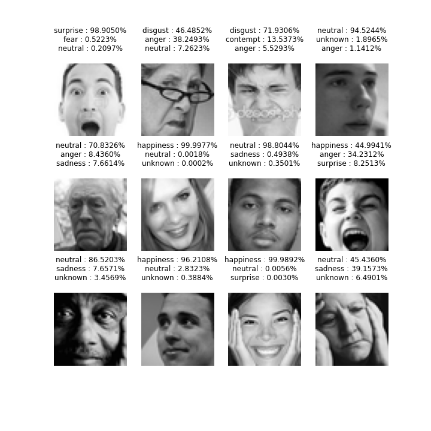
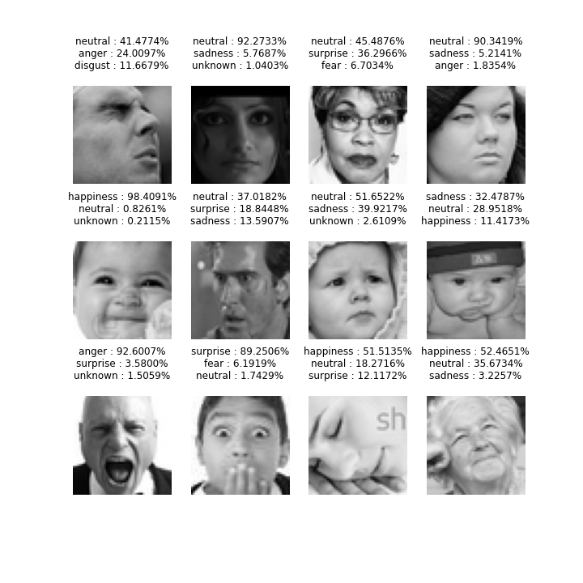

# Age and Gender Estimation



This is a adaptation of MobileNet and MobileFaceNet Keras models for face emotion recognition task. The reference model was trained on refined version of [FER2013](https://www.kaggle.com/c/challenges-in-representation-learning-facial-expression-recognition-challenge/data) dataset, but can be fine-tuned or retrained on other datasets, as long as they follow the same convention.

This repository is specifically created to train smaller models, that are suitable for running on embedded devices with constrained resources while still achieving acceptable accuracy. 

In refined version of FER2013 dataset called [FER+](https://github.com/microsoft/FERPlus) each image has been labeled by 10 crowd-sourced taggers, which provide better quality ground truth for still image emotion than the original FER labels. Thus the model is trained to predict percentage of each emotion for given face - the labels **ARE NOT** hot encoded, but the sum of the prediction output is 1.0. To give an example one's face can be described as 60% neutral and 38% sad - that would be moderately sad expression, as opposed to 95% sad, which would be crying, i.e extremely sad.

As such the model is evaluated during training using Mean Absolute Error rather than top-1 accuracy. Although top-1 accuracy can be obtained using evaluation script, it **should not** be used as main performance metric for this particular approach. 

Final MAE of pre-trained MobileFaceNet model (alpha = 1.0, total params: 212,617, model size: 3.1 Mb Raspberry Pi 4 CPU inference time: ) is 0.0578, top-1 accuracy is 77% on test subset of FER+.


## Dependencies
- Python3.5+
- Tensorflow 2.4.1
- numpy, Pandas, tqdm
- dlib (for demo)
- OpenCV3

Tested on:
- Ubuntu 18.04, Python 3.9.4, Tensorflow 2.4.1, CUDA 10.1.243, cuDNN 7.6.5
- CPU: i5-6500 CPU@3.20GHz, GPU: GeForce GTX1080


## Usage

### Use pretrained model for demo


Run the demo script (requires web cam).
You can use `--image_dir [IMAGE_DIR]` option to use images in the `[IMAGE_DIR]` directory instead.

```sh
python3 tests/demo.py
```

The pretrained model for TensorFlow backend will be automatically downloaded to the `pretrained_models` directory.

### Download or create training data
First, download the dataset.
The dataset is downloaded and extracted to the `data` directory by:

```sh
./download.sh
```

You can re-create dataset yourself by downloading:
 - FER2013
 - FER+

 And then running generate_training_data.py from FER+ repository to get train/valid/test images in .png format. Then use notebooks/convert_dataset.py to process .csv data and divide it into three .csv files. 

### Train network
Train the network using the training data created above.

```sh
python train.py --train_csv data/train.csv  --validation_csv data/valid.csv --lr 1e-3 --alpha 1.0 --aug
```

Trained weight files are stored as `checkpoints/weights.*.hdf5` for each epoch if the mean average error becomes less than in previous epochs.

```
usage: train.py [-h] --train_csv TRAIN_CSV --validation_csv VALIDATION_CSV [--batch_size BATCH_SIZE] [--img_size IMG_SIZE] [--nb_epochs NB_EPOCHS]
                [--lr LR] [--opt OPT] [--alpha ALPHA] [--bottleneck_weights BOTTLENECK_WEIGHTS] [--checkpoint CHECKPOINT] [--model_type MODEL_TYPE]
                [--aug] [--output_path OUTPUT_PATH]

This script trains the CNN model for facial emotion estimation.

optional arguments:
  -h, --help            show this help message and exit
  --train_csv TRAIN_CSV
                        path to train database csv file (default: None)
  --validation_csv VALIDATION_CSV
                        path to validation database csv file (default: None)
  --batch_size BATCH_SIZE
                        batch size (default: 32)
  --img_size IMG_SIZE   image size (default: 48)
  --nb_epochs NB_EPOCHS
                        number of epochs (default: 50)
  --lr LR               initial learning rate (default: 0.001)
  --opt OPT             optimizer name; 'sgd' or 'adam' (default: adam)
  --alpha ALPHA         alpha parameter for filter number (default: 0.5)
  --bottleneck_weights BOTTLENECK_WEIGHTS
                        bottleneck_weights (default: None)
  --checkpoint CHECKPOINT
                        checkpoint to continue training (default: None)
  --model_type MODEL_TYPE
                        MobileNet or MobileFaceNet (default: MobileFaceNet)
  --aug                 use data augmentation if set true (default: False)
  --output_path OUTPUT_PATH
                        checkpoint dir (default: checkpoints/2021-07-28_11-31-08)

```

### Use the trained network

```sh
python3 tests/demo.py
```

```
usage: demo.py [-h] [--model_file MODEL_FILE] [--margin MARGIN] [--image_dir IMAGE_DIR]

This script detects faces from web cam input, and estimates face emotion for the detected faces.

optional arguments:
  -h, --help            show this help message and exit
  --model_file MODEL_FILE
                        path to weight file (e.g. weights.28-3.73.hdf5) (default: None)
  --margin MARGIN       margin around detected face (default: 0.1)
  --image_dir IMAGE_DIR
                        target image directory; if set, images in image_dir are used instead of webcam (default: None)

```

Please use the best model among `checkpoints/weights.*.hdf5` for `MODEL_FILE` if you use your own trained models.

### Evaluation

#### Evaluation on the FER+ dataset
You can evaluate a trained model on the FER+ (test) dataset by:

```b
usage: evaluate_test.py [-h] [--model_file MODEL_FILE]

This script evaluate face emotion estimation model using the FER+ test data.

optional arguments:
  -h, --help            show this help message and exit
  --model_file MODEL_FILE
                        path to weight file (e.g. weights.28-3.73.hdf5) (default: None)
```

Please refer to [here](https://github.com/microsoft/FERPlus) for the details of the FER+ dataset.

The results of pretrained model is:

```
Top result accuracy: 0.7742025741466144
Class-wise MAE: 
neutral      0.123708
happiness    0.066834
surprise     0.057518
sadness      0.084724
anger        0.061439
disgust      0.017457
fear         0.035667
contempt     0.021012
unknown      0.051911
Name: 0, dtype: object
Total MAE: 0.05780777047146134

```



## For further improvement
If you want better results, there would be several options:

- increase alpha parameter to see how large of the model you can get without overfitting
- when overfitting becomes a problem it would be sensible to use EMOTIC or Google Facial Expression Comparison Dataset datasets instead


## License
This project is released under the MIT license.

> All the images are collected from the Internet, and the copyright belongs to the original owners. If any of the images belongs to you and you would like it removed, please contact the original dataset creators.

